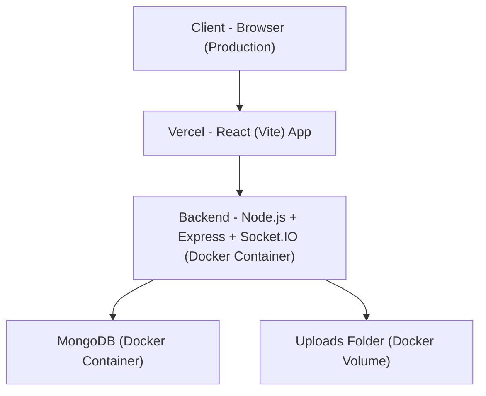

# 📌 Chatico Chat – תיעוד הפרויקט

יישום צ'אט מלא (Full-Stack) הכולל SPA בצד לקוח + שרת Node.js, עם תמיכה בהודעות בזמן אמת, קבוצות, העלאת קבצים ו-WebSockets (Socket.IO).

---

## 🚀 סקירה כללית (Overview)

**מה המערכת עושה?**

- הרשמה והתחברות משתמשים  
- יצירת שיחות פרטיות וקבוצתיות  
- שליחת הודעות טקסט וקבצים בזמן אמת  
- שמירת נתונים ב-MongoDB  
- עדכוני Live באמצעות Socket.IO  

**מטרת הפרויקט:**  
להדגים בניית אפליקציית צ'אט מודרנית, מהירה, וידידותית לפריסה באמצעות Docker ו-Docker Compose.

---

## 🏗️ ארכיטקטורת המערכת



**הסבר קצר:**

- המשתמש ניגש ל־Frontend שמאוחסן ב־Vercel.  
- ה-Frontend מתקשר עם ה־Backend דרך REST API ו-Socket.IO.  
- ה-Backend מתקשר עם MongoDB (ב-Container נפרד).  
- קבצים (attachments) נשמרים בתיקיית `uploads` המשויכת ל-Volume.

---

## 🧰 טכנולוגיות עיקריות

### Frontend

- React (Vite) – אפליקציה חד-עמודית (SPA) מודרנית ומהירה.  

### Backend

- Node.js + Express – REST API, Middleware, Static Files.  
- Socket.IO – תקשורת בזמן אמת (Real-Time Messaging).  
- MongoDB + Mongoose – מודלים ל־Users, Conversations, Messages.  
- Multer – טיפול בהעלאת קבצים (תמונות/קבצים).  

### DevOps / אבטחה

- Docker + Docker Compose – הרצת server + mongo בסביבות מבודדות.  
- JWT – אימות משתמשים.  
- Helmet – הקשחת HTTP headers.  
- CORS – הגדרת מקורות מותרים ל-Frontend.

---

## 📁 מבנה הפרויקט (Project Structure)

```bash
client/                      # אפליקציית React (Vite)
  src/
    components/              # קומפוננטות UI
    store.js                 # ניהול state גלובלי + Socket.IO client
    api.js                   # axios wrapper, קריאות לשרת
    main.jsx                 # נקודת כניסה לאפליקציה

server/                      # Backend (Node.js + Express + Socket.IO)
  src/
    routes/
      auth.js                # מסלולי הרשמה/התחברות/משתמש נוכחי
      messages.js            # מסלולי הודעות + העלאת קבצים
    models/
      User.js                # מודל משתמש
      Conversation.js        # מודל שיחה/קבוצה
      Message.js             # מודל הודעה
    socket.js                # לוגיקת Socket.IO
    config.js                # קריאת ENV וערכי ברירת מחדל
    index.js                 # נקודת כניסה לשרת
  Dockerfile                 # בניית תמונת Docker לשרת

docker-compose.yml           # הגדרת שירותים: server + mongo + volumes
.env.example                 # דוגמת משתני סביבה
README.md                    # תיעוד הפרויקט (קובץ זה)
```

---

## 🖥️ קבצים חשובים – Server

- `server/src/index.js`  
  נקודת הכניסה לשרת:  
  - חיבור ל-MongoDB  
  - הגדרת Middleware (helmet, cors, morgan וכו’)  
  - הגדרת static folder ל־`/uploads`  
  - יצירת HTTP server + Socket.IO server  

- `server/src/config.js`  
  קריאת משתני סביבה (`process.env`) והגדרת ערכי ברירת מחדל.

- `server/src/routes/auth.js`  
  מסלולים:
  - `POST /api/auth/register` – יצירת משתמש חדש  
  - `POST /api/auth/login` – התחברות והחזרת JWT  
  - `GET /api/auth/me` – החזרת פרטי המשתמש לפי ה-JWT  

- `server/src/routes/messages.js`  
  - יצירה ושליפה של הודעות  
  - `POST /api/messages/upload` – העלאת קבצים עם Multer ושמירת URL  

- `server/src/models/User.js`  
  סכמת משתמש: `username`, `email`, `passwordHash`, `displayName` וכו’.

- `server/src/models/Conversation.js`  
  סכמת שיחה/קבוצה: `participants`, `lastMessageAt` וכו’.

- `server/src/models/Message.js`  
  סכמת הודעה: `sender`, `body`, `attachment`, `createdAt`, `delivered`, `read` וכו’.

- `server/src/socket.js`  
  - אימות Socket לפי JWT  
  - הצטרפות לחדרי שיחה  
  - האזנה ל־events כגון: `message:send`, `user:typing` וכו’  
  - שידור הודעות ומשתמשים typing לשאר הלקוחות בחדר.

- `server/Dockerfile`  
  בניית תמונת Docker עבור השרת – מיועדת ל-Compose/Production.

---

## 🎨 קבצים חשובים – Client

- `client/src/main.jsx`  
  Mount של האפליקציה, חיבור ל-store ול-socket.

- `client/src/api.js`  
  Wrapper מעל axios כולל פונקציות לגישה ל-REST API ול-upload קבצים (`/api/messages/upload`).

- `client/src/store.js`  
  ניהול state גלובלי, חיבור ל-Socket.IO, שליחת הודעות, עדכוני UI (כולל optimistic updates).

- `client/src/components/MessageInput.jsx`  
  קומפוננטת UI להזנת טקסט, בחירת קבצים ושליחת הודעות.

- `client/src/components/MessageList.jsx`  
  הצגת רשימת הודעות, טקסט + attachments, אפשרות לצפייה/הורדה של קבצים.

---

## 🔄 Flow בסיסי של המערכת

1. **הרשמה/התחברות**  
   הלקוח שולח בקשות ל־`/api/auth/*`.  
   השרת יוצר/מאמת משתמש ומחזיר JWT.

2. **פתיחת Socket.IO**  
   הלקוח פותח חיבור Socket.IO עם ה-JWT לצורך אימות.  

3. **שליחת הודעה**  
   - דרך REST: `POST /api/messages`  
   - או דרך Socket.IO: event מסוג `message:send`  
   השרת שומר את ההודעה ב-Mongo ומשדר אותה למשתמשים הרלוונטיים בחדר.

4. **העלאת קובץ**  
   - הלקוח מבצע `POST /api/messages/upload` עם `multipart/form-data`.  
   - Multer שומר את הקובץ בתיקיית `uploads`.  
   - השרת מחזיר URL לצפייה/הורדה, וה-URL נשמר כחלק מההודעה.

5. **גישה לקבצים**  
   - קבצים סטטיים זמינים דרך `GET /uploads/:filename` עם כותרות CORS מתאימות.

---

## 🔐 משתני סביבה (Environment Variables)

הקובץ `.env.example` מכיל דוגמאות. יש להעתיק אותו ל־`.env` ולמלא ערכים:

```env
# -------------------------------------------------------
# MongoDB connection string (Atlas or local)
# Example (Atlas):
# MONGO_URI=mongodb+srv://<user>:<password>@cluster0.xxxx.mongodb.net/myDatabase
# Example (Local):
# MONGO_URI=mongodb://localhost:27017/myDatabase
MONGO_URI=

# -------------------------------------------------------
# Secret key used to sign and verify JWT tokens.
# Generate a secure secret with:
#   openssl rand -hex 32
JWT_SECRET=

# -------------------------------------------------------
# Port on which the server will run (e.g. 4000)
PORT=

# -------------------------------------------------------
# The origin (URL) of the client application (frontend) allowed by CORS.
# Production example:
# CLIENT_ORIGIN=https://chatproject-azure.vercel.app
CLIENT_ORIGIN=
```

## ⚙️ התקנה והרצה מקומית

### 1️⃣ כניסה לתיקיית השרת

```bash
cd server
```

### 2️⃣ יצירת קובץ `.env` מתוך `.env.example`

```bash
cp .env.example .env
```

מלאו את הערכים בקובץ `.env` לפי ההסברים למעלה.

### 3️⃣ התקנת תלויות

```bash
npm install
```

### 4️⃣ בנייה והרצה עם Docker Compose

```bash
open Docker Desktop
docker compose --env-file .env up -d --build
```

### 5️⃣ בדיקת קונטיינרים רצים

```bash
docker compose ps
```

### 6️⃣ צפייה בלוגים של השרת

```bash
docker compose logs -f server
```

### (בסוף) 7️⃣ עצירה/הורדת הקונטיינרים

```bash
docker compose down
```

---

## 🧪 בדיקות בסיסיות

לאחר הרצה תקינה, בלוגים אמורות להופיע הודעות כגון:

```text
[MongoDB] connected: ...
[Server] listening on 4000
```

כדי לבדוק את היישום:

1. פתחו את כתובת ה-Frontend (Production):  
   `https://chatproject-azure.vercel.app/`
2. פתחו דפדפן רגיל ועוד חלון Incognito.  
3. הירשמו עם שני משתמשים שונים.  
4. התחילו לשלוח הודעות ביניהם ולוודא שהן מופיעות בזמן אמת.

---

## 🐳 למה Docker / Docker Compose?

- סביבה עקבית בין מפתחים שונים.  
- אין צורך להתקין MongoDB על המחשב המקומי – הכל בתוך Containers.  
- הפרדה ברורה בין שירותים: Server, Database, Volumes.  
- מתאים לפריסה לשרתים בענן או ל-VPS בצורה פשוטה.  

---

## ✅ סיכום

הפרויקט מדגים:

- ארכיטקטורת Full-Stack מודרנית לצ'אט בזמן אמת.  
- שימוש ב-WebSockets (Socket.IO) + REST במקביל.  
- שימוש ב-Docker ו-Docker Compose לניהול סביבה.  
- ניהול קבצים וצירופם להודעות.  

## 📷 תצלומי מסך (Screenshots)

לנוחותכם, מצורף קובץ בשם **Screenshots_app.docx** הכולל  
תמונות מסך מהאפליקציה, כדי שתוכלו להתרשם מהממשק ומהפונקציונליות של Chatico Chat.
כמו כן מצורף סירטון Demo of the app.mp4 שמדמה שימוש באפליקציה.
